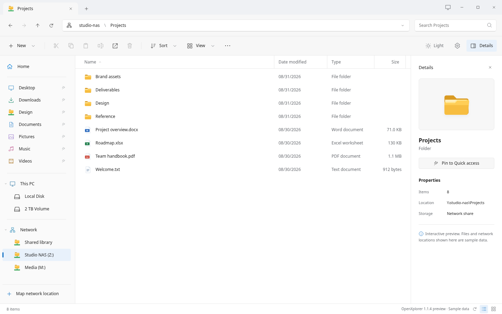

# OpenXplorer for Arch Linux

**Lowtrixx's fork of [OpenXplorer](https://github.com/AKolenda/openxplorer), focused on Arch Linux and Arch-based distributions such as CachyOS.** The upstream project targets Zorin OS; this fork focuses on Arch packaging, compatibility and code maintenance.

A Windows File Explorer-inspired file manager for local folders and SMB shares, with tabs, clickable paths, pinned folders, search and light/dark themes. Version **2.0.0** uses native GTK 4 widgets and Rust. See the [native backlog](native/BACKLOG.md) for remaining feature and integration gaps.

**[Fork repository](https://github.com/Lowtrixx/openxplorer)** · **[Fork releases](https://github.com/Lowtrixx/openxplorer/releases)** · **[Fork issues](https://github.com/Lowtrixx/openxplorer/issues)** · **[Upstream website](https://openxplorer.app)**



*The legacy HTML interface, captured in Chromium with fictional files. This image is not a capture of the native GTK 4 application or a live SMB connection.*

## Build and install on Arch Linux

Build the stable package from this fork using the included [PKGBUILD](native/packaging/arch/PKGBUILD). Start with an updated system and the packaging tools:

```sh
sudo pacman -Syu --needed base-devel git python
```

Rust **1.92 or newer** is required. If you do not already have Rust, install the distribution's toolchain with `sudo pacman -S --needed rust`. If you use `rustup`, keep it and run `rustup toolchain install stable`; the PKGBUILD selects that toolchain. Both setups provide Cargo.

```sh
git clone https://github.com/Lowtrixx/openxplorer.git
cd openxplorer
python3 native/tools/source_archive.py --output-directory dist/arch
cp native/packaging/arch/PKGBUILD dist/arch/
cd dist/arch
_app_id=io.winspace.Development makepkg --syncdeps --install
openxplorer
```

Run `makepkg` as your normal user. It asks for privileges when installing dependencies and the finished package. Dependencies include **GTK 4.14+**, SQLite and libsoup 3; no Node.js runtime is needed for the installed app.

The source archive contains committed files, so commit local source changes before building. Setting `_app_id` as shown builds the stable `openxplorer` package; omitting it builds the separate `openxplorer-native` preview.

Before upgrading an existing installation, finish file operations and run `openxplorer --quit`. You can also install a compatible package from this fork's releases, when one is available, with `sudo pacman -U ./openxplorer-<version>-<release>-x86_64.pkg.tar.zst`.

### Optional desktop integration

Install the backends for the features you use:

| Package | Purpose |
|---|---|
| `gvfs` | Recycle Bin and volume integration |
| `gvfs-smb` | Browsing SMB shares |
| `gvfs-mtp` | MTP phones and devices |
| `gnome-keyring` | A Secret Service provider for saved SMB credentials |
| `file-roller` | External archive manager |
| `cifs-utils` | Persistent SMB mounts through the optional mount helper |

For example, `sudo pacman -S --needed gvfs gvfs-smb` adds the file and SMB backends. Reuse an existing Secret Service provider if your desktop already supplies one.

Installation does not make OpenXplorer the default file manager. Default-app changes, persistent mounts, folder relocation and browser-profile integration remain opt-in. Existing `winspace` settings paths and application IDs are preserved for compatibility.

### Verified scope

The stable x86-64 package has been built with `makepkg` and installed on CachyOS. Package layout, installed files, shared-library dependencies and `openxplorer --version` were checked. The native Location tab has been tested under Xvfb with disposable folders and XDG configuration, including confirmation, validation and applying a path change without moving files. Full GUI behavior, Wayland and live SMB have not yet been validated for this fork. The PKGBUILD also declares `aarch64`, but that build has not been verified here.

The [packaging guide](native/packaging/README.md), [documentation](docs/introduction.md) and [changelog](CHANGELOG.md) retain upstream material, including instructions for other distributions. They do not imply that this fork publishes those packages. Use the Arch instructions above for this fork.

## Develop

The app lives in `native/` (Rust, GTK 4, GIO/GVfs); see [native/README.md](native/README.md). The Next.js website lives in `apps/web/`. The installed app does not depend on Node or pnpm.

**Legacy code:** `desktop/` holds the Python/GTK 3/WebKitGTK app of OpenXplorer 1.x. It remains the behavioural reference for the native app (`native/parity/`) and supplies the website demo, compatibility tests and packaged mount helper. This fork may maintain that shared code, but the installed desktop application is the Rust version in `native/`.

For the website, use Node.js 22.13+ and pnpm 10.34.5:

```sh
pnpm install --frozen-lockfile
pnpm dev
```

See [native setup](native/README.md), [website setup](apps/web/README.md) and the [development guide](docs/development.md) for prerequisites, builds and checks.

## Contribute

Open issues and pull requests in **[Lowtrixx/openxplorer](https://github.com/Lowtrixx/openxplorer)**. Work from a feature branch and target this fork's `main`. Changes in this fork are maintained independently; contributing them to the upstream project is a separate decision.

Read [CONTRIBUTING.md](CONTRIBUTING.md) for development and review guidance. [SECURITY.md](SECURITY.md) describes security boundaries and the upstream vulnerability-reporting route; do not post sensitive reports or credentials in public issues.

## License

Project changes, website and project-authored documentation are **[AGPL-3.0-only](LICENSE)**, with documented file-level exceptions. Preserve the upstream Winspace [MIT notice](licenses/Winspace-MIT.txt), [NOTICE](NOTICE) and [third-party notices](THIRD_PARTY_NOTICES.md).

Independent project; not affiliated with Microsoft, Zorin, Canonical, Debian or Vercel. No warranty.
